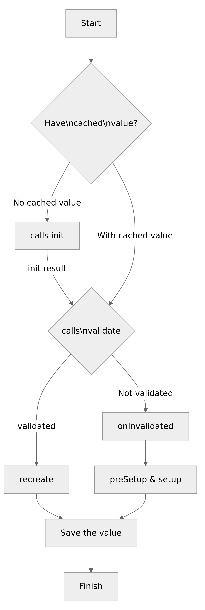

# cypress-data-session

[![ci status][ci image]][ci url] [![renovate-app badge][renovate-badge]][renovate-app] 

> Cypress command for flexible test data setup

## Blog posts

📝 Read the blog posts

- [Flexible Cypress Data Setup And Validation](https://glebbahmutov.com/blog/cypresss-data-session/)
- [Faster User Object Creation](https://glebbahmutov.com/blog/faster-user-creation/)
- [Crawl Weather Using Cypress](https://glebbahmutov.com/blog/crawl-weather/)
- [Minimize Mailosaur Use](https://glebbahmutov.com/blog/minimize-mailosaur-use/)

Look at the presentation slides [Flexible Data Setup And Caching For Cypress.io Tests](https://slides.com/bahmutov/data-for-e2e-tests).

## Training

🎓 This plugin is covered in my course [Cypress Plugins](https://cypress.tips/courses/cypress-plugins):

- [Lesson j1: Create and cache an item](https://cypress.tips/courses/cypress-plugins/lessons/j1)
- [Lesson j2: Data session lifecycle](https://cypress.tips/courses/cypress-plugins/lessons/j2)
- [Lesson j3: Dependent data sessions](https://cypress.tips/courses/cypress-plugins/lessons/j3)
- [Lesson j4: Decide what to cache in the data session](https://cypress.tips/courses/cypress-plugins/lessons/j4)
- [Lesson j5: Share the data session between specs](https://cypress.tips/courses/cypress-plugins/lessons/j5)
- [Lesson j6: Instant login using a data session](https://cypress.tips/courses/cypress-plugins/lessons/j6)
- [Lesson o4: Create data once using the support file hook](https://cypress.tips/courses/cypress-plugins/lessons/o4)

And in my course [Testing The Swag Store](https://cypress.tips/courses/swag-store)

- [Lesson 14: Instant login using cypress-data-session](https://cypress.tips/courses/swag-store/lessons/lesson14)
- [Bonus 33: Expire data session after N milliseconds](https://cypress.tips/courses/swag-store/lessons/bonus33)

## cy.dataSession vs cy.session

Some people have noticed similarities between `cy.dataSession` command implemented by this plugin and the [cy.session](https://on.cypress.io/session) command included in Cypress itself. Here is my table of differences.

| Feature                   | cy.session                | cy.dataSession |
| ------------------------- | ------------------------- | -------------- |
| Command is                | official ✅               | community 🎁   |
| Can cache                 | the browser session state | anything       |
| Stability                 | production                | production     |
| Cache across specs        | yes                       | yes            |
| Access to the cached data | no                        | yes            |
| Custom validation         | no                        | yes            |
| Custom restore            | no                        | yes            |
| Dependent caching         | no                        | yes            |
| Time limit                | no                        | yes            |
| Use count limit           | no                        | yes            |
| Static utility methods    | limited                   | all            |
| GUI integration           | yes                       | no             |
| Should you use it?        | maybe                     | yes            |
| Cypress version support   | newer versions            | all            |

## Videos

- [Introduction to cypress-data-session package](https://youtu.be/As5yqkoZOx8) for creating two chat rooms in the chat application
- [Use Data Alias Created Automatically By cypress-data-session](https://youtu.be/VQtjDGCuRzI)
- [Create User Using cypress-data-session Command](https://youtu.be/P-sb5OHSNsM)
- [Invalidate cy.session From cypress-data-session](https://youtu.be/SyDz6l_EFoc)
- [Share Data Across Specs Using cypress-data-session Plugin](https://youtu.be/ws4TitQJ7fQ)
- [Use cy.dataSession To Create A User And Log In](https://youtu.be/PTlcRBgFJaM)
- [Quickly Create A User And Log in Using Dependent Data Sessions](https://www.youtube.com/watch?v=0KTGc83wSoA)
- [Introduction To cypress-data-session Plugin](https://youtu.be/7ipCvJQixI0) for setting up 3 todo items in a TodoMVC app
- [Instant AWS Cognito Login Using cypress-data-session](https://youtu.be/eB9RqBmnN4I)

## Install

```shell
$ npm install -D cypress-data-session
# or using Yarn
$ yarn add -D cypress-data-session
```

Import this package from the spec or from the support file

```js
// cypress/support/index.js
import 'cypress-data-session'
```

If you plan to use the [shareAcrossSpecs](#shareacrossspecs) option, you need to load this plugin from your plugin file

### v10

```js
// cypress.config.js
import { defineConfig } from 'cypress'
const registerDataSession = require('cypress-data-session/src/plugin')

export default defineConfig({
  e2e: {
    setupNodeEvents(on, config) {
      registerDataSession(on, config)
      return config
    },
  },
})
```

### v9

```js
// cypress/plugin/index.js
module.exports = (on, config) => {
  require('cypress-data-session/src/plugin')(on, config)
}
```

### Types

If using JavaScript, point the spec at this package using the `///` comment

```js
// from your spec.js
/// <reference types="cypress-data-session" />
```

See [src/index.d.ts](./src/index.d.ts)

## Use

You can call `cy.dataSession` with simple 3 arguments or with an options object that allows you to pass more options.

### three arguments

```js
cy.dataSession(sessionName, setupFunction, validateValueFunction)
```

This example comes from [spec.cy.js](./cypress/e2e/spec.cy.js)

```js
beforeEach(() => {
  // let's say you want to set up the value "A"
  cy.dataSession(
    'A', // data name
    () => 'a', // data creation commands
    (x) => x === 'a', // data validation function
  )
})

it('has object A', () => {
  expect(Cypress.getDataSession('A')).to.equal('a')
})
```

The value is automatically added as an alias, so you can use `function () { ... }` syntax for the test callback and access the above value using `this.A` property

```js
it('exists under an alias', function () {
  expect(this.A).to.equal('a')
})
```

Note: if the `setup` function's text changes, the session is recomputed.

### validate

The `validate` predicate can use Cypress commands, but must ultimately yield a boolean value.

```js
// validate a room id by fetching it from the database
// using cy.task and finding the room
const validate = (id) => {
  return cy.task('getRooms', null, { log: false }).then((rooms) => {
    // important: make sure to return a Boolean
    // otherwise _.find returns undefined
    // and Cypress cy.then callback returns the previous value
    return Boolean(Cypress._.find(rooms, { _id: id }))
  })
}
```

The `validate` function is optional. If you skip it, the `setup` will be run every time.

```js
// without "validate" function, the "setup" runs every time
cy.dataSession(name, setup)
```

You can also pass a boolean value, which is useful during debugging.

```js
validate: true // no need to recompute the value, it is still valid
validate: false // call setup again
```

See [validate.cy.js](./cypress/e2e/validate.cy.js) spec.

### onInvalidated

You can pass a function as the last argument to the `cy.dataSession` to be called if the "validate" returns false. This function will be called _before_ the "setup" function executes.

```js
function onInvalidated() {
  // clear user session for example
}
cy.dataSession(name, setupUser, validateUser, onInvalidated)
```

See an example in the spec [invalidate.cy.js](./cypress/e2e/invalidate.cy.js) and video [Invalidate cy.session From cypress-data-session](https://youtu.be/SyDz6l_EFoc).

### Options object

You can pass multiple parameters using a single options object, see [options.cy.js](./cypress/e2e/options.cy.js)

```js
cy.dataSession({
  name: 'C',
  setup: () => 'c',
  validate: (x) => x === 'c',
})
```

### recreate

Using the options object you can pass another function to be called after the `validate` yields true. This function let's you to perform Cypress commands with the validated value to "finish" the recreation. For example, you could visit the page after setting the cookie from the data session to end on the page, just like the `setup` does.

```js
cy.dataSession({
  name: 'logged in',
  setup: () => {
    // create user, visit the page, log in
    // let's say we are on the page '/home
    // save the cookie in the data session
    cy.getCookie('connect.sid')
  },
  // assume the cookie is valid
  validate: (c) => true,
  recreate (cookie) => {
    cy.setCookie(cookie)
    cy.visit('/home')
  }
})
```

### shareAcrossSpecs

By default, the data session value is saved inside `Cypress.env` object. This object is reset whenever the spec gets reloaded (think Cmd+R press or the full browser reload). The object is gone when the `cypress run` finishes with a spec and opens another one. If you want the data value to persist across the browser reloads, or be shared across specs, use the `shareAcrossSpecs: true` option.

```js
cy.dataSession({
  name: 'shared value',
  setup: () => 'a',
  validate: (x) => x === 'a',
  shareAcrossSpecs: true,
})
```

The first spec that creates it, saves it in the plugin file process. Then other specs can re-use this value (after validation, of course).

### preSetup

Sometimes you might need to run a few steps before the `setup` commands. While you could have these commands inside the `setup` function, it might make clear to anyone reading the code that these commands are preparing the data for the `setup` function. For example, you could check if the user you are about to create exists already and needs to be deleted first.

```js
cy.dataSession({
  name: 'user',
  preSetup() {
    cy.task('findUser', 'Joe').then((user) => {
      if (user) {
        cy.task('deleteUser', user._id)
      }
    })
  },
  setup() {
    // create the user "Joe"
  },
  validate(saved) {
    // check if the user "Joe" exists
  },
})
```

### dependsOn

A data session can depend on another data session or even multiple data sessions. For example, the data session "logged in user" can depend on the "created user" data session. If the "parent" session changes, we need to recompute all sessions that depend on it.

```js
cy.dataSession({
  name: 'created user',
  setup() {
    // create a user
  },
})

cy.dataSession({
  name: 'logged in user',
  dependsOn: 'created user',
  setup() {
    // take the user object from
    // the data session "created user"
    // and log in
  },
})
```

If the "created user" gets invalidated and recomputed (its `setup` method runs again), then the data session "logged in user" is invalidated automatically.

To list dependencies on multiple data sessions, pass an array of names

```js
dependsOn: ['first', 'second', 'third']
```

### init

Sometimes the data is generated, but sometimes we want to first see if we can load / initialize it the very first time (when there is nothing in the cache). This is where the `init` callback is useful. For example, let's say we are creating a special test user using the method `setup` and store its ID in the cache.

```js
cy.dataSession({
  name: 'test user',
  setup() {
    cy.task('createUser') // yields the user ID
  },
  validate: Cypress._.isString,
})
```

But what happens if there is a test user already created by the previous tests? The very first time we run the data session, we want to check if there is a test user, and if it exists, store its ID and NOT call the `setup` function. Thus we add the `init` function

```js
cy.dataSession({
  ...
  init () {
    cy.task('findUser', 'test user') // yields the ID if found
  }
})
```

The above example will find the test user (by calling the `cy.task`) the very first time the command runs, since there is nothing in the data session yet. Then it validates the ID. If there is no ID, it runs the `setup` function to create the test user. If there is a test user, and it returned the ID from the `init` method, then it is cached (as if the `setup` method created it), and the test continues.

### fetch the current data session value

You can simply request the current data session, if any

```js
cy.dataSession('sessionName').then(value => {
  ...
})
```

If the data session is not found in memory, it tries to fetch it from the plugins space (maybe it is shared across specs). If still not found, it throws an error.

### showValue

By default, the `cy.dataSession` only prints its messages. You can also print the actual data value into Cypress Command Log using the `showValue: true` option

```js
cy.dataSession({
  name: 'my value',
  setup() {
    return 42
  },
  showValue: true,
}).should('equal', 42)
// The Command Log will have a message like
// "my value has data 42"
```

### expires

You can automatically recompute the data session by calling its `setup` method if more than N milliseconds have passed since the data session was set up.

```js
cy.dataSession({
  name: 'valid for 1 second,
  setup() {
    return 42
  },
  expires: 1000 // ms
})
```

### limit

You can limit how many times a piece of cached data is used before automatically recomputing it. For example, to limit a cached item to be used 3 times only (including the the first one):

```js
beforeEach(() => {
  cy.dataSession({
    name: 'limited',
    setup() { ... },
    limit: 3
  })
})
it('works 1', () => {
  // first use, calls setup() in the beforeEach hook
})
it('works 2', () => {
  // second use, uses cached value the beforeEach hook
})
it('works 3', () => {
  // third use, uses cached value in the beforeEach hook
})
it('works 4', () => {
  // over the limit, has to recompute the data
  // calls setup() in the beforeEach hook
})
```

### recomputeOnRetry

Sometimes you want to enable test retries, but the data caching makes it hard to understand and run the full test. You can set the `recomputeOnRetry: true` to automatically call the `setup` again on tet retries.

## Flow

Consider the `cy.dataSession(options)` where the `options` object might have the following method callbacks: `validate`, `init`, `setup`, `preSetup`, `recreate`, and `onInvalidated`. Your case might provide just some of these callback functions, but let's say you have provided all of them. Here is how they will be called.

- First, the code pulls cached data for the session name.
- if there is no cached value:
  - it calls the `init` method, which might return a value
  - if there is a value, and it passes `validate` callback
    - it saves the value in the data session and finishes
    - else it needs to generate the real value and save it
      - it calls `preSetup` and `setup` methods and saves the value
- else (there is a cached value):
  - it calls `validate` with the cached value
  - if the `validate` returns `true`, the code calls `recreate` method
  - else it has to recompute the value, so it calls `onInvalidated`, `preSetup`, and `setup` methods

### Flowchart

<!--
Mermaid charts can be previewed using VSCode extension
Name: Markdown Preview Mermaid Support
Id: bierner.markdown-mermaid
VS Marketplace Link: https://marketplace.visualstudio.com/items?itemName=bierner.markdown-mermaid
-->



<details>
  <summary>Flowchart source</summary>


</details>

## Examples

- [bahmutov/chat.io](https://github.com/bahmutov/chat.io)

## Global methods

A few global utility methods are added to the `Cypress` object for accessing the data sessions. These methods are mostly utilities used internally.

- `Cypress.getDataSession(name)`
- `Cypress.getDataSessionDetails(name)`
- `Cypress.getSharedDataSessionDetails(name)`
- `Cypress.clearDataSession(name)`
- `Cypress.clearDataSessions()`
- `Cypress.dataSessions(enable)`
- `Cypress.setDataSession(name, value)`
- `Cypress.formDataSessionKey(name)`
- `Cypress.printSharedDataSessions`

### getDataSession

Returns the data for the session with the given name (if any).

### getDataSessionDetails

Returns the session with data and internal details, useful for debugging. If the session is not in memory, but stored in the plugin process, use `getSharedDataSessionDetails`.

### getSharedDataSessionDetails

Fetches the session details from the plugin process.

### dataSessions

Without any arguments, this static method lists all current data sessions.

### clearDataSessions

Clears all current data sessions from memory.

### clearDataSession

Clears the given data session from memory, from aliases, and from the plugin space (if shared). If running inside a test, automatically runs inside `cy.then` to be part of the command chain. Can be used from the DevTools console

```js
cy.dataSession('user', ...)
// rest of cy commands
// remove the data session "user"
Cypress.clearDataSession('user')
```

## Migration

### from v1 to v2

The default value for the `validate` option changed from `false` to `true`, meaning any non-nil value is valid and does not require to be recomputed.

```js
// v1
cy.dataSession(name, setup, true)
// v2
cy.dataSession(name, setup)
```

Same for the option form

```js
// v1
cy.dataSession({
  name,
  setup,
  validate: true,
})
// v2
cy.dataSession({
  name,
  setup,
})
```

If you previously set `validate` to false, keep it the same

```js
// v1, v2
cy.dataSession(name, setup, false)
```

## Debugging

This plugin uses [debug](https://github.com/visionmedia/debug#readme) module to output verbose messages. Start Cypress with the environment variable `DEBUG=cypress-data-session` to see the messages in the terminal. From a Linux terminal we can use:

```shell
$ DEBUG=cypress-data-session npx cypress open
```

**Tip:** read how to set the system environment variables on different operating systems [here](https://www.twilio.com/blog/2017/01/how-to-set-environment-variables.html)

To see the verbose log messages in the Cypress browser, open the DevTools and in the top window context set the local storage property

```js
localStorage.debug = 'cypress-data-session'
```

Make sure the "verbose" logs are visible. Then you should see the debug logs while the plugin executes its code in the browser, just like this image shows:


## See also

Custom command creation and publishing to NPM described in these blog posts:

- [Writing a Custom Cypress Command](https://glebbahmutov.com/blog/writing-custom-cypress-command/)
- [How to Publish Custom Cypress Command on NPM](https://glebbahmutov.com/blog/publishing-cypress-command/)

## Small print

Author: Gleb Bahmutov &lt;gleb.bahmutov@gmail.com&gt; &copy; 2021

- [@bahmutov](https://twitter.com/bahmutov)
- [glebbahmutov.com](https://glebbahmutov.com)
- [blog](https://glebbahmutov.com/blog)
- [videos](https://www.youtube.com/glebbahmutov)
- [presentations](https://slides.com/bahmutov)
- [cypress.tips](https://cypress.tips)
- [Cypress Advent 2021](https://cypresstips.substack.com/)

License: MIT - do anything with the code, but don't blame me if it does not work.

Support: if you find any problems with this module, email / tweet /
[open issue](https://github.com/bahmutov/cypress-data-session/issues) on Github

## MIT License

Copyright (c) 2021 Gleb Bahmutov &lt;gleb.bahmutov@gmail.com&gt;

Permission is hereby granted, free of charge, to any person
obtaining a copy of this software and associated documentation
files (the "Software"), to deal in the Software without
restriction, including without limitation the rights to use,
copy, modify, merge, publish, distribute, sublicense, and/or sell
copies of the Software, and to permit persons to whom the
Software is furnished to do so, subject to the following
conditions:

The above copyright notice and this permission notice shall be
included in all copies or substantial portions of the Software.

THE SOFTWARE IS PROVIDED "AS IS", WITHOUT WARRANTY OF ANY KIND,
EXPRESS OR IMPLIED, INCLUDING BUT NOT LIMITED TO THE WARRANTIES
OF MERCHANTABILITY, FITNESS FOR A PARTICULAR PURPOSE AND
NONINFRINGEMENT. IN NO EVENT SHALL THE AUTHORS OR COPYRIGHT
HOLDERS BE LIABLE FOR ANY CLAIM, DAMAGES OR OTHER LIABILITY,
WHETHER IN AN ACTION OF CONTRACT, TORT OR OTHERWISE, ARISING
FROM, OUT OF OR IN CONNECTION WITH THE SOFTWARE OR THE USE OR
OTHER DEALINGS IN THE SOFTWARE.

[ci image]: https://github.com/bahmutov/cypress-data-session/workflows/ci/badge.svg?branch=main
[ci url]: https://github.com/bahmutov/cypress-data-session/actions
[renovate-badge]: https://img.shields.io/badge/renovate-app-blue.svg
[renovate-app]: https://renovateapp.com/
